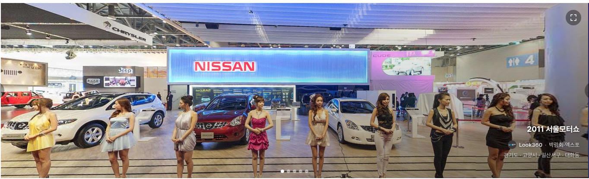
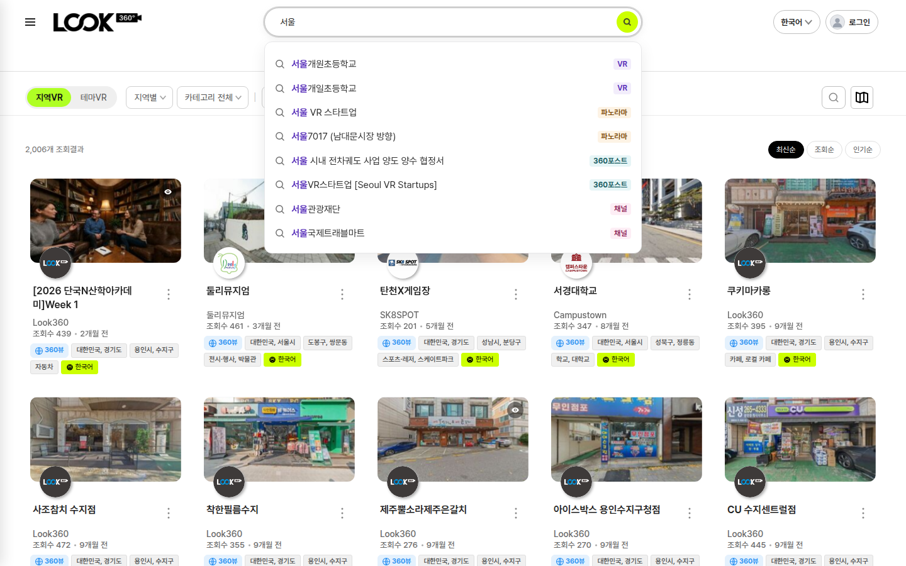
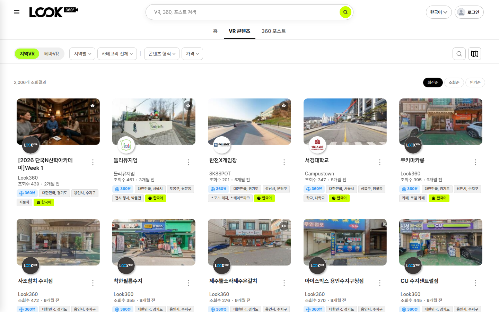
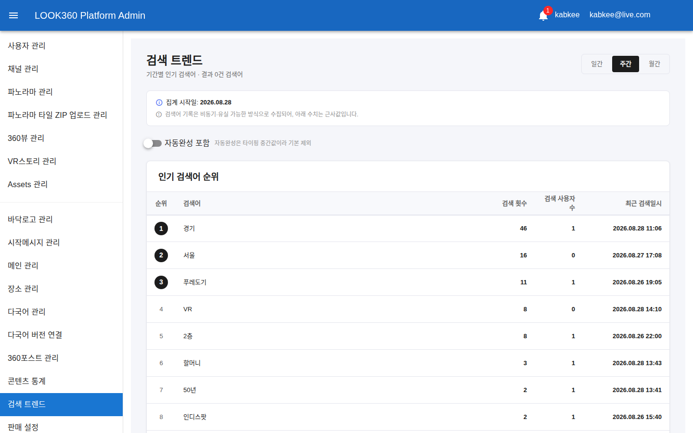
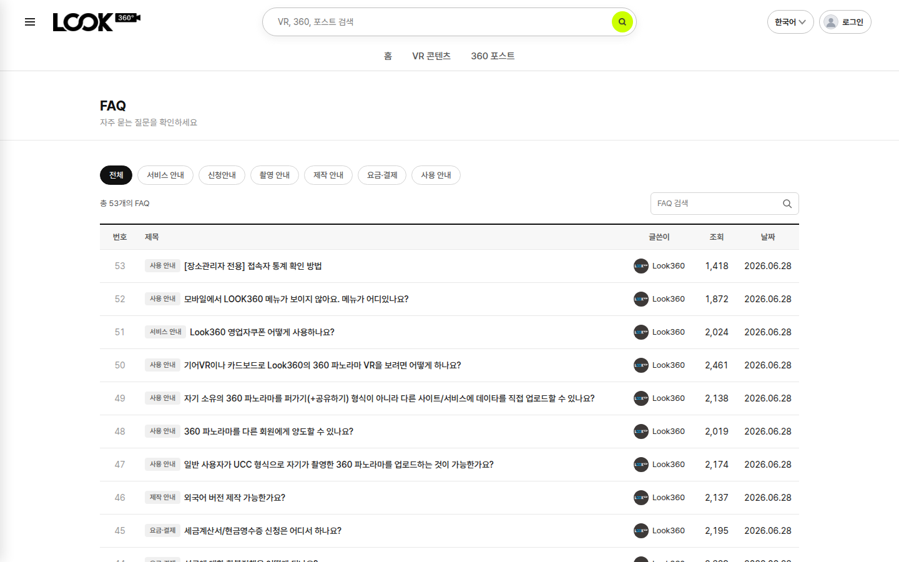
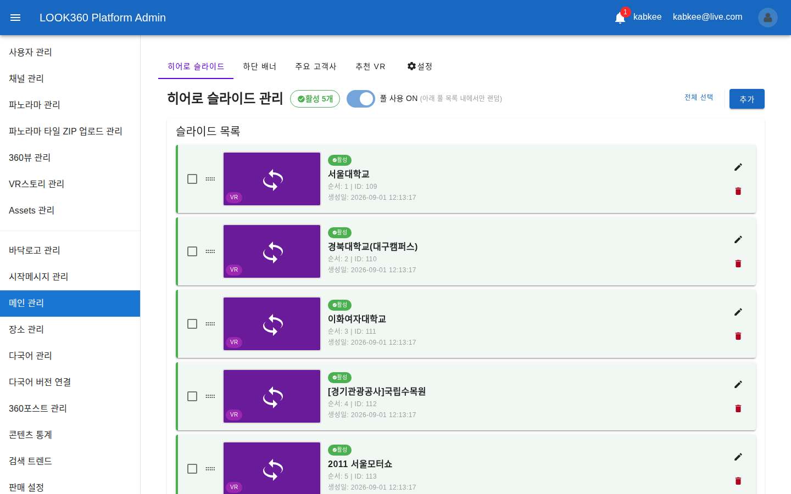
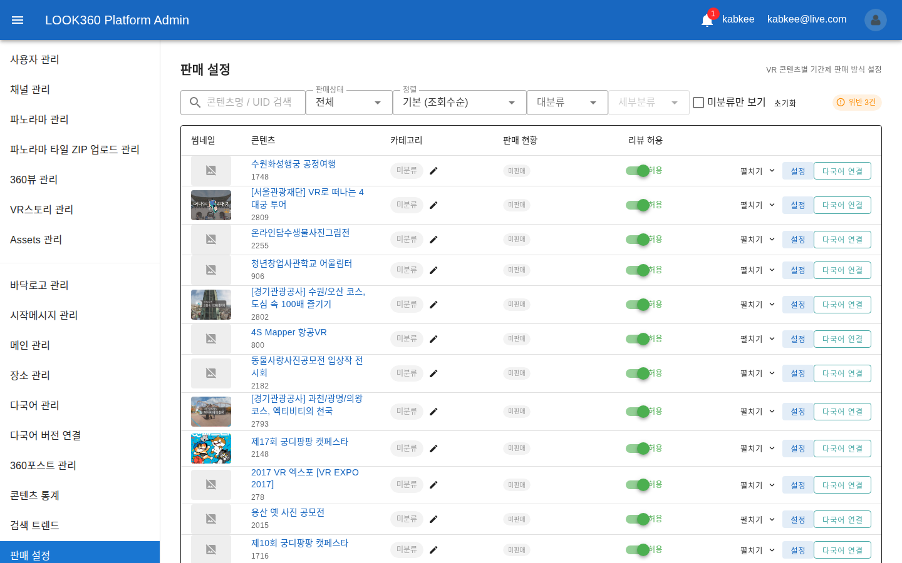

<!-- _class: cover -->
<!-- _paginate: false -->

# 주간 업무 보고

## 2026-08-26 &nbsp;~&nbsp; 2026-09-01

Indyspot AI Corp &nbsp;·&nbsp; Engineering Manager &nbsp;·&nbsp; 2026-09-02

---

<!-- _class: agenda -->

## 이번 주 주요 작업 — 「첫 화면을 다시 만들고, 관리자에게 눈을 달아준」 주간

### 🏠 홈 화면 — 전면 재설계

- 메인 슬라이드를 360VIEW 전용 자동재생으로 교체 · 매번 다른 콘텐츠가 랜덤 노출
- 노출 대상에서 유료 콘텐츠를 전면 차단하고, 어떤 콘텐츠를 넣을지 관리자가 직접 구성

### 🎬 VR 감상 화면 — 언어 축 정리

- 언어를 바꿔도 번역되지 않던 표시들(카테고리·지역·국가) 전면 교정
- 개발용 코드(`education`)가 화면에 그대로 노출되던 것 차단

### 🔍 목록·검색

- 검색 자동완성에서 장소를 빼고 360포스트를 추가 · 종류 배지 표시

### 🛠️ 관리자 화면 — 신설 2종

- 검색 트렌드 통계 신설 — 인기 검색어 · 결과가 0건인 검색어
- FAQ 카테고리 관리 신설 — 7종 분류 + 사용 중인 분류 삭제 차단

### 💰 판매 상품 보호

- 미리보기 없는 상품이 팔리지 않도록 상시 감시 + 자동 알림
- 실제로 팔리는데 관리자가 보지도 끄지도 못하던 90일·365일 상품 정상화

### 🗺️ 데이터 · 다국어

- 지역 필터가 비던 원인인 주소 연결 끊김 복구 + 재발 방지 검사
- 사이트 언어 2종 → 7종 확대 (번역 진행 중)

---

<!-- _class: sec -->

Section 01

## 홈 화면 — 첫인상을 다시 만들다

메인 슬라이드를 이미지 배너에서 「실제로 돌려볼 수 있는 360VIEW」로 교체했습니다.

---

## 🏠 홈 메인 슬라이드 360VIEW 전면 교체 8/27~8/29 NEW

기존 배너는 관리자가 하나씩 등록한 고정 이미지였습니다. 이제 실제 360VIEW 콘텐츠가 자동으로 재생되며, 방문할 때마다 다른 콘텐츠가 나옵니다.

<figcaption>실제 개발 서버 홈 화면 — 자동재생 중인 360VIEW · 우하단 3줄 정보(제목 / 채널·카테고리 / 지역) · 우상단 전체화면 버튼 · 하단 랜덤 5장 인디케이터</figcaption>

---

## 🔄 무엇이 바뀌었나 8/27~8/29

| 항목 | 기존 | 변경 후 |
|------|------|---------|
| 슬라이드 내용 | 관리자가 등록한 고정 이미지 | 360VIEW 콘텐츠 자체가 재생 |
| 노출 방식 | 등록 순서대로 고정 | 페이지를 열 때마다 랜덤 |
| 재생 시작 | 재생 버튼을 눌러야 시작 | 자동재생 (버튼 제거) |
| 화면 넘김 | 일정 시간마다 자동 전환 | 자동 전환 폐지 — 감상 중 끊기지 않음 |
| 표시 정보 | 제목만 | 제목 · 채널 · 카테고리 · 지역 · 테마 3줄 |
| 조작 | 불가 | 화면을 직접 돌려볼 수 있음 + 전체화면 |

> 모바일에서 슬라이드 위에 손가락이 닿으면 페이지 스크롤이 막혀 아래로 내려갈 수 없던 문제(일명 개미지옥)도 함께 해소했습니다.

---

## 🛡️ 홈에 나오면 안 되는 콘텐츠 차단 8/29 NEW

랜덤 노출이 도입되면서 아무 콘텐츠나 첫 화면에 뜰 수 있는 위험이 생겼습니다. 노출 자격을 서버에서 다시 판정하도록 했습니다.

| 보호 장치 | 내용 |
|-----------|------|
| 유료 콘텐츠 전면 차단 | 돈을 받고 파는 콘텐츠는 홈에서 무료로 보이지 않습니다 |
| 언어판 중복 제거 | 같은 콘텐츠의 여러 언어판 중 요청 언어 1건만 노출 |
| 관리자 구성 단계 차단 | 부적격 콘텐츠는 담는 시점에 사유와 함께 거부 |
| 회귀 시험 | 이 필터에 대한 자동 시험이 0건이던 것을 신규 작성 |

> 감상 기록 오염도 함께 발견해 처리 중입니다 — 홈 슬라이드는 로그인 사용자의 「내가 본 콘텐츠」에 자동 기록되고 있었습니다. 보지 않은 콘텐츠가 기록되던 문제로, 수정은 완료되어 검토 단계입니다.

---

## 🧩 홈 화면 나머지 결함 3건 8/31~9/1

### 추천 VR — 설정과 실제가 달랐음

- 관리자가 바꾼 설정과 홈에 실제로 나오는 목록이 서로 달랐습니다
- 원인은 과거 2026-06-24 시점 목록이 계속 우선 노출되던 것
- 관리자 화면에 차이를 알려주는 경고 배너와 상태 배지를 신설

### 메인 설정 · 타이틀

- 관리자 메인 설정 4종 중 실제로 동작하지 않던 항목 배선 복구
- 쓰이지 않는 「고객사 개수」 입력란 제거
- 홈 「추천VR·최신VR」 제목을 눌러도 아무 일도 없던 것을 클릭 차단 처리하고, 더보기에 정렬이 유지되는 링크 적용

> 미리보기 썸네일이 깨진 경우 무한 로딩 표시로 위장되던 문제도 함께 수정했습니다.

---

<!-- _class: sec -->

Section 02

## VR 감상 화면 — 「언어를 바꿨는데 안 바뀌는 것들」

콘텐츠 언어를 전환했을 때 따라 바뀌지 않던 표시를 전수 정리했습니다.

---

## 🈯 언어를 바꿔도 안 바뀌던 표시 8/26~8/27 NEW

오너가 직접 뷰어에서 언어를 바꿔 보며 발견한 결함들입니다. 이 한 건에서만 23개 작업이 나왔습니다.

| 무엇이 문제였나 | 어떻게 해결했나 |
|-----------------|-----------------|
| 카테고리 자리에 `education`, `experience_center` 같은 개발용 코드가 그대로 노출 | 번역이 없으면 요청 언어 → 한국어 → 코드 순으로 대체하도록 변경 |
| 「콘텐츠 종류 / 지역 / 주소 / 언어」 칩이 한국어 고정 | 이 표시들을 콘텐츠 언어 축에 연결 |
| 국가명이 브라우저 언어로 새어 나옴 (일부 언어에서) | 브라우저가 모르는 언어 4종에 대한 3단계 대체 규칙 신설 |
| 파노라마 경로 표시가 서로 겹쳐 읽을 수 없음 | 가운데 줄임 + 모바일은 전체 경로 팝업 |

---

## 🔤 언어 전환 동작 자체의 결함 8/25~8/28

### 상태가 되돌아오지 않던 문제

- 언어 선택을 취소해도 원문으로 돌아오지 않음
- 언어 칩이 항상 「한국어」로 표시 (VRSTORY 포함)
- 360포스트가 실시간으로 반영되지 않음

### 불필요한 서버 요청 제거

- 「선택 → 적용」 시 같은 요청이 2회 중복 발신되던 것 3개 지점에서 제거
- 비용 정책 판정 완료 — 「적용」 전에 언어를 고르기만 해도 번역이 발신되던 건은 정산 기준을 확정

| 부가 수정 | 내용 |
|-----------|------|
| 자동번역 태그 | VR 상세에서 태그만 한국어로 남던 것 교정 + 잠긴 138건 백필 |
| 일본어·중국어 | 「번역 중」 문구가 한국어로 노출되던 키 보강 |

---

## 🎛️ 감상 화면 사용성 5건 8/27~8/28

| 항목 | 변경 내용 |
|------|-----------|
| 「보기 방식」 6종 | 한국어 고정이던 표시를 다국어화 + ⓘ 아이콘 설명 툴팁 신설 |
| 브라우저 뒤로가기 | 파노라마를 이동한 뒤 뒤로 가면 화면 밖으로 튕기던 것을 파노라마 단위 뒤로/앞으로로 변경 |
| 푸터 링크 | LOOK360 표기 가독성 개선 + 이용약관 새 창 연결 |
| 화살표 아이콘 | 필터·토글·헤더별 크기를 8px / 10px / 12px 로 재조정 (오너 지시로 이전 수치 변경) |
| 원문보기 토글 | 좋아요 버튼과 붙어 있던 여백 정리 |

> 「보기 방식」은 VR을 어떻게 볼지 고르는 기능(일반·자이로·VR 안경 등)으로, 무엇인지 몰라 못 쓰던 기능에 설명을 붙였습니다.

---

<!-- _class: sec -->

Section 03

## 목록 · 검색 — 찾는 경로를 정리

카드 표시 규격과 검색 자동완성의 「결과 주체」를 재정의했습니다.

---

## 🔍 검색 자동완성 — 무엇을 보여줄 것인가 8/28~8/29 NEW

기존 자동완성은 장소(place)를 함께 보여줬습니다. 사용자가 찾는 것은 장소가 아니라 볼 수 있는 콘텐츠라는 판단으로 소스를 교체했습니다.

<figcaption>실제 화면 — VR · 파노라마 · 360포스트 · 채널 배지로 종류를 구분. 장소는 제거됨</figcaption>

---

## 📋 목록 카드 표시 규격 8/27~8/28

### 무엇이 바뀌었나

- 채널 프로필 배경을 흰색으로 통일 (8개 지면 전수)
- 프로필을 누르면 채널로 바로 이동
- 좋아요를 눌러도 더보기 메뉴가 닫히지 않음
- 검색결과 파노라마 카드에 원본 VR 제목 추가
- 한 페이지 노출을 24개로 조정 + 화면 폭에 따른 열 수 규칙 정비

---

<!-- _class: sec -->

Section 04

## 마이페이지 · 알림

사용자 개인 지면의 조작 결함을 정리했습니다.

---

## 👤 마이페이지 · 알림 5건 8/27~9/1

| 지면 | 무엇이 문제였나 | 조치 |
|------|-----------------|------|
| 구매한 콘텐츠 | 정렬 상자가 화면에 잘려 보이지 않음 | 커스텀 목록으로 교체 + 키보드 조작 정정 |
| 좋아요한 360포스트 | 실수로 눌러도 즉시 취소됨 | 확인 팝업 추가 (기존 VR과 동일) |
| 알림 카테고리 | 항목이 많으면 줄바꿈되어 흐트러짐 | 1줄 가로 스크롤 + 좌우 화살표 |
| 사이드 메뉴 | 로그아웃이 링크로 보이지 않음 | 밑줄 + 마우스 효과 |
| 관리자 알림벨 | 클릭하면 전건 404 | 관리자·개인 알림을 각각 올바른 화면으로 분기 |

> 관리자 알림벨의 「모든 알림 보기」는 이동할 화면 자체가 없어 버튼을 제거했습니다.

---

<!-- _class: sec -->

Section 05

## 관리자 화면 — 없던 눈을 달다

관리자가 볼 수 없던 정보를 화면으로 만들었습니다. 이번 주 신설 2종입니다.

---

## 📊 검색 트렌드 통계 화면 8/28 NEW

사용자가 무엇을 검색하는지, 그리고 검색했는데 아무것도 못 찾았는지를 처음으로 볼 수 있게 됐습니다.

<figcaption>관리자 화면 실측 — 일간·주간·월간 전환 · 인기 검색어 순위 · 결과 0건 검색어 · 집계 시작일 안내</figcaption>

---

## 📈 검색 트렌드 — 무엇을 볼 수 있나 8/28

| 구성 | 내용 |
|------|------|
| 인기 검색어 | 기간별 검색어 순위 · 검색 횟수 · 검색 사용자 수 |
| 결과 0건 검색어 | 사용자가 찾았지만 콘텐츠가 없어 빈손으로 돌아간 검색어 — 콘텐츠 확보 우선순위 판단에 사용 |
| 집계 안내 | 언제부터 집계된 수치인지 배너로 표시 (현재 2026-08-28부터) |
| 자동완성 제외 | 타이핑 중간값이 순위를 왜곡하지 않도록 기본 제외 (토글로 포함 가능) |

> 이를 위해 검색 기록에 「결과 몇 건이 나왔는지」를 저장하는 항목을 신설하고, 검색을 호출하는 7개 지점을 모두 새 방식으로 이관했습니다. 기록되지 않던 정보라 집계는 신설 시점부터 쌓입니다.

---

## ❓ FAQ 카테고리 개편 8/27~8/28 NEW

FAQ에 7종 분류를 도입하고, 관리자가 직접 분류를 관리할 수 있게 했습니다.

<figcaption>실제 화면 — 상단 분류 필터 칩 + 제목 앞 분류 칩. 기존 53건 전건에 분류 배정 완료</figcaption>

---

## 🔐 FAQ — 관리자 기능과 안전장치 8/27~8/28

| 기능 | 내용 |
|------|------|
| 분류 관리 | 관리자 화면에서 추가 · 이름 변경 · 비활성 |
| 삭제 차단 | 한 건이라도 사용 중이면 삭제 불가 — 사유를 안내 팝업으로 표시 |
| 글 작성·수정 | 분류를 선택해서 등록 (서버 기준 목록 사용) |
| 기존 53건 | 전건 분류 배정 완료 |

> 개편 중 발견해 함께 고친 것 — 관리자가 새로 쓴 FAQ가 공개 목록에 나오지 않던 문제, 그리고 새 글에 한해 삭제 차단이 작동하지 않던 허점입니다.

---

## 🎚️ 홈 슬라이드를 관리자가 직접 구성 8/28 NEW

홈에 어떤 360VIEW를 몇 장 노출할지 관리자가 직접 정합니다. 풀을 비워두면 전체 360VIEW에서 랜덤 노출됩니다.

<figcaption>관리자 화면 실측 — 「풀 사용 ON」 토글 · 활성 5개 · 순서 지정. 앞 슬라이드의 홈 화면에 이 목록이 그대로 반영됩니다</figcaption>

---

<!-- _class: sec -->

Section 06

## 판매 · 상품 보호

「팔면 안 되는 상태의 상품」이 팔리지 않도록 자동 감시를 붙였습니다.

---

## 🛒 미리보기 없는 상품 상시 감시 8/28 NEW

유료 상품은 구매 전 미리보기가 반드시 있어야 합니다. 그동안은 위반해도 아무도 알 수 없었습니다.

| 층 | 조치 |
|----|------|
| 상시 감시 | 정기 검사로 위반 상품을 찾아 판매자·관리자에게 자동 알림 |
| 사전 차단 | 미리보기를 없애는 편집 자체를 저장 시점에 차단 |
| 서버 이중 가드 | 판매 활성화 요청도 서버에서 재검사 |
| 관리자 화면 | 차단 사유를 화면에 안내 문구로 표시 |
| 상시 노출 | 판매 설정 화면 상단에 현재 위반 건수를 항상 표시 — 알림을 놓쳐도 보입니다 |

---

## ⚠️ 위반 건수가 화면에 항상 보인다 9/1 NEW

<figcaption>관리자 판매 설정 화면 실측 — 우측 상단 「위반 3건」 배지. 알림을 받지 못해도 화면에 들어오는 순간 바로 보입니다</figcaption>

---

## 📅 판매 기간 90일 · 365일 정상화 9/1 NEW

### 무엇이 문제였나

- 실제로 90일·365일 상품이 판매되고 있는데, 관리자 화면에는 그 항목이 없었습니다
- 관리자가 보지도, 끄지도, 가격을 바꾸지도 못하는 상태

### 어떻게 해결했나

- 서버 판매 기간 목록에 90일·365일 정식 추가
- 관리자 판매 설정에 해당 슬롯 노출
- 사용자 화면 표기도 동일 기준으로 정합
- 대상 상품 4건 전수 왕복 검증

> 관리자가 통제할 수 없는 상태로 상품이 팔리고 있던 것으로, 운영 리스크에 해당하여 우선 처리했습니다.

---

<!-- _class: sec -->

Section 07

## 데이터 정합 · 다국어 기반

화면 뒤에서 조용히 어긋나 있던 것들을 바로잡았습니다.

---

## 🗺️ 지역 필터가 비어 있던 원인 8/29~8/31

VR 목록의 지역별 필터가 일부 콘텐츠를 잡지 못했습니다. 콘텐츠의 주소와 지역 정보가 연결되지 않은 상태였기 때문입니다.

| 무엇을 했나 | 내용 |
|-------------|------|
| 실복구 | 해외 주소 형식(일본 로마자 · 태국 공백 구분) 대응 후 연결 결측 복구 |
| 유령 데이터 정리 | 지역 정보가 스스로 복제된 유령 12건 + 딸린 15건 제거, 콘텐츠 30건 재연결 |
| 재발 방지 | 실패해도 조용히 넘어가던 6개 지점에 기록 신설 + 데이터 이관 후 자동 검사 3종 추가 |
| 신규 유입 차단 | 새로 생성되는 장소에도 국가 정보를 필수로 받도록 변경 |

> 이 검사는 현재 데이터에서 일부러 실패가 나오도록 설계했습니다 — 남은 결측을 계속 보이게 하기 위함입니다.

---

## 🌐 사이트 언어 2종 → 7종 확대 8/29~8/31

### 진행 상황

- 대상: 한국어 · 영어 · 일본어 · 중국어 · 스페인어 · 독일어 · 러시아어
- 화면 문구 6,358개 키를 번역 대상으로 확정
- 스페인어·독일어·러시아어 신규 3종 번역 진행
- 검증 통과분부터 사이트 언어 선택 목록에 순차 개방

### 남은 작업 · 대기

- 지역명 1,919건 × 7언어 번역용 파일 산출 완료 — 오너 번역 대기
- 지역명 접미사 표기 규칙 승인 대기
- 러시아어 지역명 1,880행 처리 방식 오너 결정 대기

> 터키어는 오너 판단으로 제외되었습니다. 번역문은 기계번역으로 자동 채우지 않고, 검수된 번역만 반영하는 방식으로 진행 중입니다.

---

## 🎯 이번 주 안건 — 오너 결정 대기

이번 주는 현장 결함 처리량이 컸고, 남은 것은 데이터 처리 방침 판단 6건입니다.

| 항목 | 내용 |
|------|------|
| 🔴 **추천VR 홈 반영** (IND-6691) | 새 목록 8건 준비 완료. 현재 홈에는 2026-06-24 목록 3건이 노출 중 — 교체 승인 필요 |
| 🔴 **감상기록 오염 정리** (IND-6696) | 홈 슬라이드가 자동 기록한 「보지 않은 감상기록」 정리 방침 선택 |
| 🟡 러시아어 지역명 (IND-6634) | 1,880행을 어떤 방식으로 채울지 결정 |
| 🟡 홈 슬라이드 잔여 파일 (IND-6672) | 사용하지 않는 21건(56.7MB) 삭제 여부 — 3건은 복구 불가 |
| 🟡 영구소장 잔여 데이터 (IND-6699) | 비활성 처리 대상 4건 처리 방식 |
| 🟡 지역 필터 연동 범위 (IND-6592) | 0건 항목 비활성 처리의 적용 범위 선택 |

> 지난주 안건 처리 — 번역 비용 정책(IND-6447) 판정 완료. 미관람 30일 소멸(IND-6298) · 정책 4·5 가동(IND-6147) · 실 카드 결제 오픈(IND-4997) · 지역명 번역 승인(IND-6465)은 이월됩니다.

---

## 📊 주간 처리량

250

완료 작업

60

작업 단위(EPIC)

209

코드 반영

2,456

주간 방문자(WAU)

| 저장소 | 코드 반영 | 변경 파일 | 내용 |
|--------|-----------|-----------|------|
| 사용자 화면 | 90건 | 99개 | 홈 · 뷰어 · 목록 · 검색 · 마이페이지 |
| 서버(API) | 100건 | 140개 | 히어로 · 판매 보호 · 검색 통계 · 지역 데이터 |
| 관리자 화면 | 19건 | 28개 | 검색 트렌드 · FAQ 관리 · 히어로 풀 · 판매 설정 |
| 검증 증빙 | 161건 | — | QC 실측 스크립트 · 검증 기록 |

> 서비스 지표(8/24~8/30): 주간 방문자 2,456명(+5.2%) · 세션 2,701건(+7.5%) · 페이지뷰 10,552회

---

## 🔗 라이브 엔드포인트

사용자
<a class="lnk" href="http://100.120.25.127:5174" target="_blank">Look360 (개발) — 홈 히어로 360VIEW 자동재생</a>

이번 주 신설
<a class="lnk" href="http://100.120.25.127:5174/faq" target="_blank">FAQ 카테고리 필터</a>
<a class="lnk admin" href="http://100.120.25.127:5277" target="_blank">관리자 — 검색 트렌드 통계</a>

결정 대기
<a class="lnk" href="http://100.120.25.127:3100/IND/issues/IND-6691" target="_blank">IND-6691 추천VR 홈 반영</a>
<a class="lnk" href="http://100.120.25.127:3100/IND/issues/IND-6696" target="_blank">IND-6696 감상기록 정리</a>

외부
<a class="lnk legacy" href="https://look360.co.kr" target="_blank">look360.co.kr (운영)</a>

---

<!-- _class: closing -->
<!-- _paginate: false -->

## 감사합니다

첫 화면을 실제로 돌려볼 수 있는 360VIEW로 바꾸고, 관리자가 볼 수 없던 검색 트렌드와 판매 위반을 화면으로 만든 주간이었습니다.

Indyspot AI Corp &nbsp;·&nbsp; Engineering Manager &nbsp;·&nbsp; 2026-09-02
