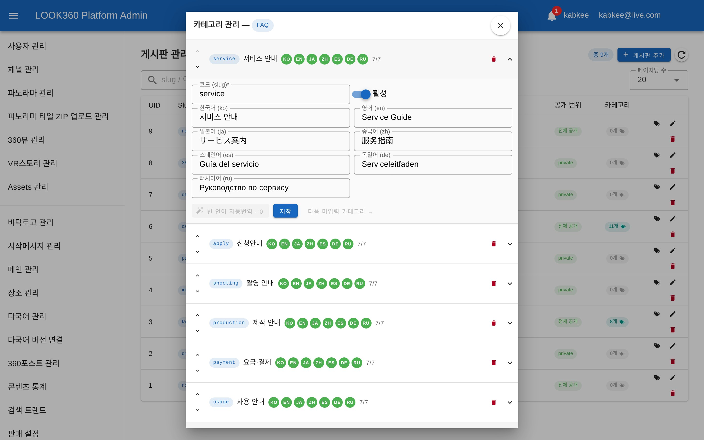
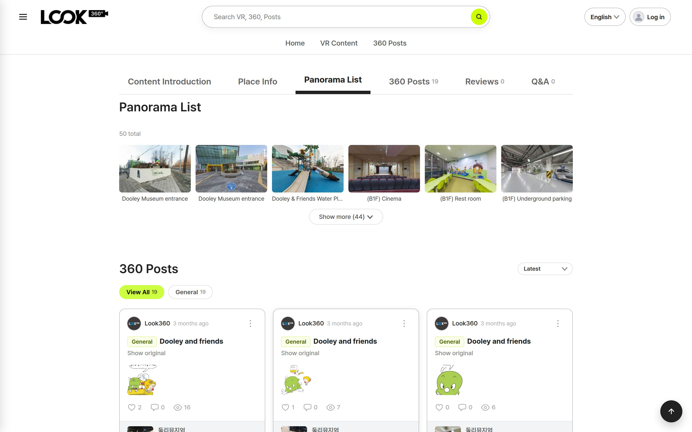
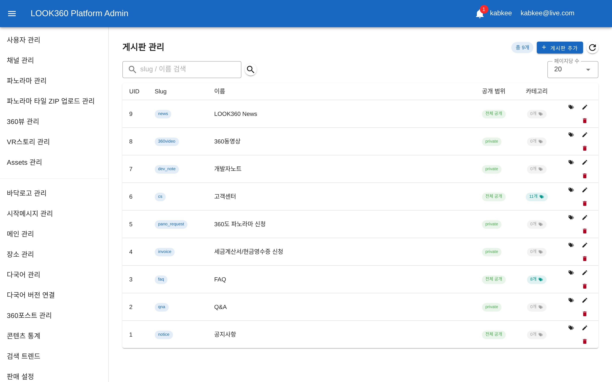
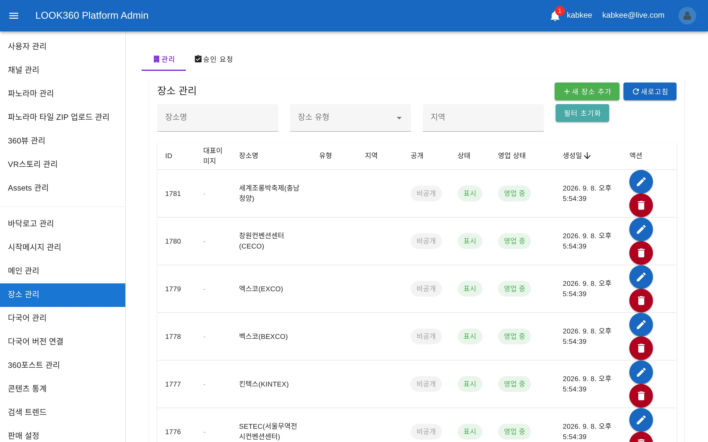
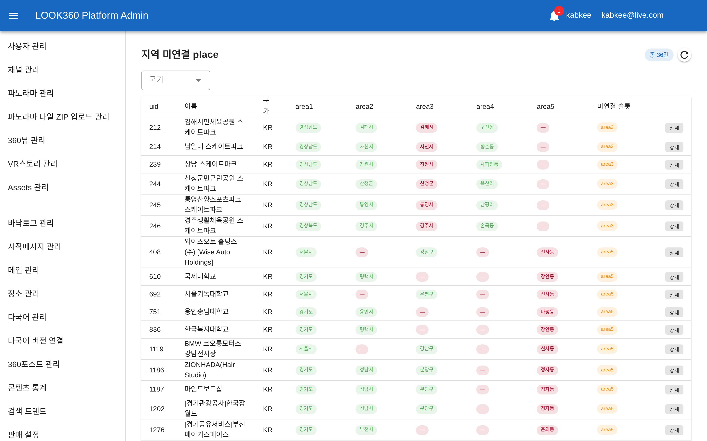
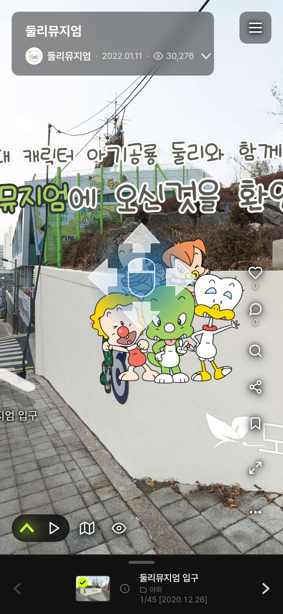
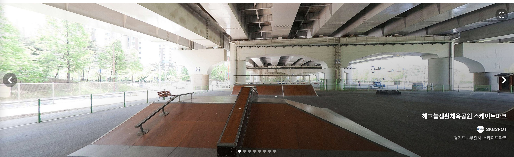
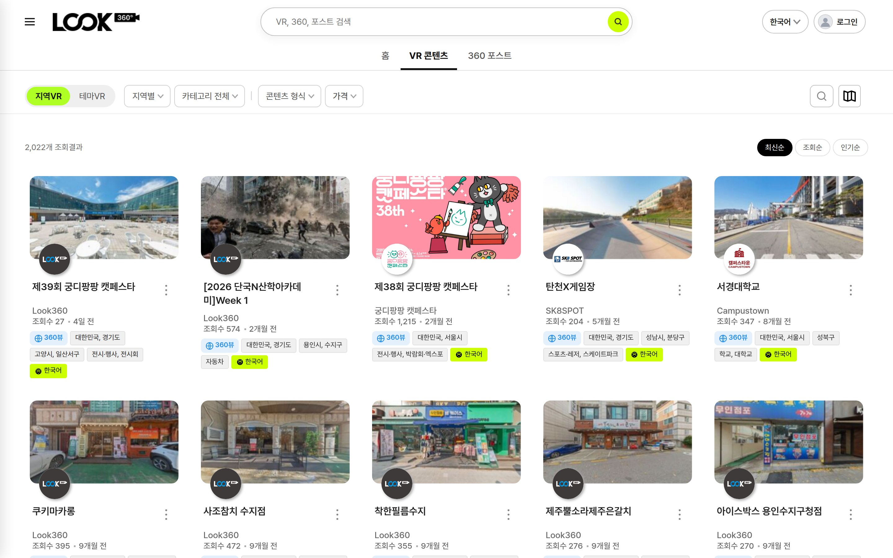

<!-- _class: cover -->
<!-- _paginate: false -->

# 주간 업무 보고

## 2026-09-02 &nbsp;~&nbsp; 2026-09-08

Indyspot AI Corp &nbsp;·&nbsp; Engineering Manager &nbsp;·&nbsp; 2026-09-09

---

<!-- _class: agenda -->

## 이번 주 주요 작업 — 「열려 있던 뒷문을 닫고, 7개 언어를 화면까지 내보낸」 주간

### 🔒 보안 — 로그인 없이 통하던 문 41곳

- 인증 없이 데이터를 지우고 고칠 수 있던 경로를 전수 점검해 32곳 차단
- 소셜 로그인에서 남의 계정으로 로그인 가능하던 결함 차단
- 회의 전 독립 재검증에서 잔여 2곳 추가 발견 → 보완 완료(9/10)

### 🌐 다국어 — 7개 언어를 화면까지

- 지역명 8,273건 7개 언어 채움 · 게시판 분류 7개 언어 완비
- 감상 화면에서 번역되지 않던 파노라마 이름 해소
- 관리자 번역 화면에 진행도 표시 + 자동번역 초안 신설

### ⚡ 성능 — 업로드 대기 5분 22초 → 4초

- 파노라마 압축파일 업로드가 5분 넘게 멈춰 있던 원인 규명 후 재설계
- 운영 서버 오류 경보 원인 특정 · 콘텐츠 삭제 시 딸린 데이터 정리 구조 신설

### 🛠️ 관리자 화면 — 손이 닿지 않던 곳

- 게시판 관리에서 실사용 게시판 9건이 아예 안 보이던 문제 해소
- 장소 수정·필터가 누르면 무조건 오류나던 것 2건 복구
- 지역 정보가 빠진 장소를 찾아 고치는 화면 신설

### 📱 360포스트 — 모바일 사용성

- 작성 중 아무 버튼도 없이 갇히던 상태 해소
- 비로그인도 작성 버튼이 보이고 누르면 바로 로그인
- 화면 방향 잠금·다시 잡기가 실제로 동작하도록 재구현

### 🚧 진행 중 (다음 주 이월)

- 지역 5단계 주소 체계 재정비 — 기존 데이터 1,448건 재배치 대기
- 러시아어 지역명 1,880건 번역 · 사진 촬영일자 정정 범위 조사 중

---

<!-- _class: sec -->

Section 01

## 보안 — 로그인 없이 지나가던 문을 닫다

작업 중 우연히 발견된 결함 하나가, 같은 성격의 문제 41곳을 찾아내는 전수 점검으로 이어졌습니다.

---

## 🔒 인증 없이 데이터를 지울 수 있었습니다 9/3~9/4 NEW

테스트 장소를 지우려다 오류 원인을 파고든 것이 출발점이었습니다. 로그인 정보를 **전혀 붙이지 않은 요청**이 거부되지 않고 데이터베이스 삭제 명령까지 도달하고 있었습니다.

| 단계 | 발견한 것 |
|---|---|
| ① 최초 발견 | 장소 삭제 경로가 무인증으로 삭제까지 도달 — 우연히 걸린 데이터 제약이 막았을 뿐 |
| ② 같은 유형 확인 | 삭제 계열에서 6곳 추가 발견 |
| ③ 전수 재점검 | 「삭제만 세었다」는 점을 깨닫고 등록·수정 계열 전체를 다시 조사 — 33곳 추가 발견 |

> 판정 기준은 **실제 호출 결과**입니다. 정상이라면 「권한 없음(401)」이 돌아와야 하는데, 문제 지점들은 「없는 데이터(404)」·「잘못된 요청(400)」을 돌려주었습니다. 요청이 이미 인증 관문을 통과해 내부 로직까지 들어갔다는 뜻입니다.

---

## 🛡️ 41곳 전수 처리 결과 9/3~9/4

| 분류 | 건수 | 내용 | 조치 |
|---|---|---|---|
| 삭제 계열 | 7 | 장소·게시물·파노라마 순서 캐시 등 | 인증 필수로 전환 |
| 파노라마 순서 저장 | 1 | 감상 순서를 무인증으로 덮어쓰기 가능 | 인증 필수로 전환 |
| 운영 제어 | 7 | 자동 실행 작업의 시작·전체 중지 등 | 인증 필수로 전환 |
| 장소·게시물 등록/수정 | 15 | 장소 등록 승인·반려, 사진 정보 수정 등 | 인증 필수로 전환 |
| 소셜 로그인 | 2 | 다음 슬라이드에서 별도 설명 | 차단 |
| 공개가 정당한 경로 | 9 | 로그인·비밀번호 찾기 등 누구나 써야 하는 기능 | 유지 (검토 후 판정) |

> 32곳을 차단하고, 9곳은 **공개되어 있는 것이 정상**임을 확인해 그대로 두었습니다. 무조건 잠그는 대신 경로마다 성격을 판정했습니다.

---

## 🚨 남의 계정으로 로그인할 수 있었습니다 9/4 NEW

가장 위험도가 높았던 건입니다. 페이스북·네이버 간편 로그인에서 해당 회사에 「이 사람이 맞느냐」고 확인하는 절차가 통째로 빠져 있었습니다.

### 무엇이 문제였나

- 정상 절차는 페이스북·네이버에 되물어 본인 확인을 받는 것입니다
- 그런데 이 경로는 전달받은 아이디 값만 보고 곧바로 로그인 처리했습니다
- 즉 **피해자의 소셜 아이디만 알면 그 계정에 들어갈 수 있는** 상태였습니다
- 없는 아이디를 보내면 무단으로 새 계정까지 생성됐습니다

### 어떻게 처리했나

- 사전 조사에서 우리 화면 어디에서도 이 경로를 쓰지 않는 것을 확인했습니다
- 정상 로그인은 본인 확인을 거치는 별도 경로로 이미 동작 중이었습니다
- 따라서 해당 경로를 막는 것으로 처리 — 사용자 영향 없음
- 실사용 여부를 먼저 확인했기에 복잡한 개조 없이 끝났습니다

> 실제 피해 흔적은 확인되지 않았습니다. 다만 **가능한 상태였다**는 점에서 이번 주 최우선으로 처리했습니다.

---

## 🔁 회의 전 독립 재검증 — 2곳이 더 나왔습니다 9/10 NEW

「정말 다 막혔는가」를 확인하려고 쓰기 경로 92곳을 **없는 번호로 전부 호출**해 봤습니다. 통과한 11곳 중 9곳은 로그인·비밀번호 찾기라 정상이었고, 2곳이 남은 결함이었습니다.

| 경로 | 확인된 동작 | 조치 |
|---|---|---|
| 파노라마 안내점 삭제 | 인증 없이 요청하면 그대로 삭제가 실행됨 | 인증 필수로 전환 |
| 장소 대표 이미지 삭제 | 인증 없이 지울 파일 경로를 지정할 수 있었음 | 인증 필수로 전환 |

> 새어 나간 이유는 **점검 대상이 한 번 좁혀졌기 때문**입니다. 처음에 「삭제 계열은 6곳」으로 확정한 뒤, 이후 재점검은 등록·수정 계열만 다시 훑어 삭제 계열은 검증 없이 넘어갔습니다. 특히 대표 이미지 삭제는 같은 이름의 경로가 두 곳에 있어 한쪽만 잡혔습니다.

---

## ✅ 재검증 결과 9/10

| 시점 | 인증 없이 통과하는 쓰기 경로 |
|---|---|
| 보완 전 | 11곳 — 공개 정당 9 + 결함 2 |
| 보완 후 | 9곳 — 전부 공개가 정상인 기능 (회원가입·로그인·비밀번호 찾기·조회수·뷰어 비밀번호 확인) |

### 노출 범위 — 운영에는 없었습니다

- 운영 서버에 이 서버 프로그램 자체가 설치되어 있지 않습니다
- 현재 위치는 사내 개발망이며 외부 인터넷에서 접근할 수 없습니다
- ⇒ 실제 서비스 피해 가능성은 없었습니다

### 다만 짚어 둘 점

- 오픈 시점에 이대로 나갔다면 실제 사고였습니다
- 이번 보안 처리는 오너 승인 없이 발견·수정까지 진행됐습니다
- 앞으로 보안 사안은 발견 즉시 보고하는 절차를 제안드립니다

---

<!-- _class: sec -->

Section 02

## 다국어 — 7개 언어를 화면까지 내보내다

지난주 「데이터를 채우는」 단계였다면, 이번 주는 그 데이터가 **실제 화면에 나오게** 하는 단계였습니다.

---

## 🌐 7개 언어 진행 현황 9/2~9/8

대상은 한국어 · 영어 · 일본어 · 중국어 · 스페인어 · 독일어 · 러시아어 7종입니다.

| 영역 | 지난주 | 이번 주 |
|---|---|---|
| 지역명 (시·도·구·동) | 결측 8,273건 · 오너 승인 대기 | 7개 언어 일괄 채움 완료 |
| 게시판·360포스트 분류 | 한국어·영어만 | 7개 언어 완비 (관리자 화면 포함) |
| 감상 화면 파노라마 이름 | 모든 언어에서 한국어 고정 | 사이트 언어를 따라 번역 |
| 장소·콘텐츠 소개글 | 일부 항목만 채워짐 | 빠진 항목만 골라 자동 보강 |
| 러시아어 지역명 1,880건 | 처리 방식 미정 | 번역 작업 진행 중 |

> 기계 번역으로 무작정 채우지 않고 검수된 번역만 반영하는 원칙은 유지하고 있습니다.

---

## 🗂️ 게시판 분류를 7개 언어로 한 화면에서 9/8 NEW

7개 언어가 한 줄에 펼쳐져 읽히지 않던 화면을 요약 행 + 펼침 편집으로 다시 만들었습니다.

직접 확인
<a class="lnk admin" href="http://100.120.25.127:5277/bbs/manage" target="_blank">http://100.120.25.127:5277/bbs/manage</a>

---

## 🎨 무엇이 좋아졌나 9/8

### 한눈에 보이는 진행도

- 분류마다 KO EN JA ZH ES DE RU 표시가 붙고, 7/7처럼 채움 개수가 나옵니다
- 색으로 상태를 구분합니다 — 사람이 입력 / 자동 번역 / 미입력
- 「다음 미입력 분류 →」 버튼으로 빈 곳만 이어서 채울 수 있습니다

### 자동 번역은 «초안»까지만

- 버튼을 눌렀을 때만 동작하고, 빈 언어에만 초안을 채웁니다
- 결과는 입력칸에 들어올 뿐 저장을 누르기 전까지 반영되지 않습니다
- 기존에 사람이 넣은 번역은 덮어쓰지 않습니다
- 저장하지 않고 나가면 확인창으로 되묻습니다

> 「번역이 사람 모르게 자동으로 저장되는 것은 금지, 버튼을 눌러 초안을 받아 확인 후 저장하는 것은 허용」이라는 오너 결정을 그대로 구현했습니다.

---

## 🖼️ 감상 화면 — 파노라마 이름이 번역되지 않던 문제 9/8 NEW

사이트 언어를 영어로 두고 자동 번역을 켜도 파노라마 이름만 한국어로 남았습니다. 아래는 수정 후 화면입니다.

직접 확인
<a class="lnk" href="http://100.120.25.127:5174/vr-info/v47cpxre" target="_blank">http://100.120.25.127:5174/vr-info/v47cpxre</a>

---

## 🔍 원인은 「번역이 없어서」가 아니었습니다 9/8

| 확인한 것 | 결과 |
|---|---|
| 같은 콘텐츠를 VR 뷰어에서 조회 | ✅ 영어로 정상 반환 (`Dooley Museum entrance`) |
| 같은 콘텐츠를 상세 지면에서 조회 | 🔴 한국어 고정 (`둘리뮤지엄 입구`) |
| 판정 | 번역 데이터는 이미 있었고, 상세 지면이 그것을 읽지 않았습니다 |

> 데이터를 새로 만드는 작업이 아니라 읽어오는 연결을 잇는 수정이었습니다. 같은 유형으로 **VR 뷰어에서 자동 번역을 켰을 때 분류·지역·테마 표시까지 함께 번역**되도록 하는 작업(오너 신규 요구)도 이번 주에 반영했습니다. 뷰어 밖 화면은 기존대로 사이트 언어를 따릅니다.

---

<!-- _class: sec -->

Section 03

## 관리자 화면 — 손이 닿지 않던 곳

「화면은 있는데 실제로는 쓸 수 없던」 기능 4건을 정상화했습니다.

---

## 📋 실사용 게시판 9건이 아예 보이지 않았습니다 9/2 NEW

목록에 10건만 표시되고 다음 장으로 넘어갈 방법이 없었습니다. 그런데 그 10건은 전부 테스트용 게시판이라, 공지사항·FAQ·고객센터 같은 실사용 게시판 9건은 관리자가 단 한 건도 열 수 없었습니다.

직접 확인
<a class="lnk admin" href="http://100.120.25.127:5277/bbs/manage" target="_blank">http://100.120.25.127:5277/bbs/manage</a>

---

## 🔧 원인과 결과 9/2~9/8

| 구분 | 내용 |
|---|---|
| 원인 ① | 목록 표에 한 페이지 표시 개수가 지정되지 않아 기본값 10건만 그려짐 |
| 원인 ② | 페이지 이동 버튼이 잘못된 기준으로 계산돼 항상 숨겨짐 |
| 조치 | 페이지당 표시 개수 선택 + 페이지 이동 복구 |
| 함께 정리 | 목록을 점거하던 테스트 게시판 24건을 정리해 실사용 9건만 남김 |

> 위 화면의 「총 9개」가 정리 결과입니다. 공지사항·Q&A·FAQ·세금계산서 신청·파노라마 신청·고객센터·개발자노트·360동영상·뉴스 9건이 모두 조회·수정 가능합니다.

---

## 🏷️ 장소 관리 — 누르면 무조건 오류나던 2건 9/7~9/8 NEW

### ① 저장이 항상 실패

- 아무 항목도 건드리지 않고 저장만 눌러도 오류가 났습니다
- 화면이 서버가 받지 않는 항목까지 전부 함께 보내던 것이 원인이었습니다
- 보낼 항목만 추려서 전송하도록 수정했습니다

### ② 「장소 유형」 필터가 목록을 깨뜨림

- 선택지를 고르는 순간 목록이 오류로 사라졌습니다
- 화면이 보내던 기준 자체가 서버에 존재하지 않았습니다 — 지금까지 한 번도 동작한 적 없음
- 실제 존재하는 분류 기준으로 교체했습니다

직접 확인
<a class="lnk admin" href="http://100.120.25.127:5277/place-management" target="_blank">http://100.120.25.127:5277/place-management</a>

---

## 🏢 복구된 장소 관리 화면 9/8

「장소 유형」 필터가 이제 실제 분류 기준(32종)으로 동작하고, 수정 저장도 정상 처리됩니다.

직접 확인
<a class="lnk admin" href="http://100.120.25.127:5277/place-management" target="_blank">http://100.120.25.127:5277/place-management</a>

---

## 🗺️ 지역 정보가 빠진 장소를 보는 화면 (신설) 9/7~9/8 NEW

지역 필터가 비어 보이던 근본 원인은 장소에 지역 정보가 연결되지 않은 것이었습니다. 이제 그 대상을 화면에서 직접 확인하고 고칠 수 있습니다.

직접 확인
<a class="lnk admin" href="http://100.120.25.127:5277/admin/regions/unlinked-places" target="_blank">http://100.120.25.127:5277/admin/regions/unlinked-places</a>

---

## 🚰 「청소」가 아니라 「수도꼭지를 잠그는」 작업 9/7

기존에는 잘못된 데이터를 사람이 찾아 지우는 방식이었습니다. 그러면 지워도 같은 데이터가 계속 새로 쌓입니다.

| 확인한 것 | 실측 결과 |
|---|---|
| 지역 정보를 제대로 채우는 정상 경로 | 코드에는 있으나 실제로는 아무도 호출하지 않음 |
| 실제로 쓰이는 경로(장소 등록 승인) | 지역 정보를 채우지 않음 |
| 결론 | 사람이 지운 만큼 계속 다시 생기는 구조였음 |

> 위 화면은 색으로 상태를 구분합니다 — 정상 / 규약 위반 / 비어 있는 자리. 현재 36건이 남아 있고, 신규 유입 경로는 이번 주 봉합했습니다. 기존 데이터 정리는 진행 중입니다(Section 06).

---

<!-- _class: sec -->

Section 04

## 360포스트 — 모바일에서 쓸 수 있게

실기기에서 오너가 직접 발견한 문제들을 그대로 반영했습니다.

---

## 📱 작성 중 아무것도 할 수 없게 갇히던 문제 9/7~9/8 NEW

### 무엇이 문제였나

- 작성 창을 아래로 내리면 취소·확인 버튼이 전부 사라져 빠져나올 수 없었습니다
- 「화면을 드래그해 보세요」 안내만 남고 아무 조작도 되지 않았습니다
- 방향을 고정했다고 했으나 실제로는 화면이 계속 움직였습니다
- 그래서 「이 위치로 확정」과 「다시 잡기」가 둘 다 의미를 잃었습니다

### 어떻게 고쳤나

- 작성 버튼을 누르는 순간 보고 있는 방향을 실제로 잠급니다
- 「위치 다시 잡기」를 누를 때만 잠금이 풀립니다
- 창을 내려도 취소 버튼이 남아 언제든 빠져나올 수 있습니다
- PC에는 적용하지 않습니다 — 오너 지시대로 모바일 전용
- 화면 회전·주소창 변화에도 창 높이가 따라옵니다

---

## 📲 모바일 감상 화면 9/7~9/8

작성 진입 버튼과 하단 정보창의 배치를 정리하고, 창 높이가 화면 변화를 따라오도록 했습니다.

직접 확인
<a class="lnk" href="http://100.120.25.127:5174/vr/v47cpxre" target="_blank">http://100.120.25.127:5174/vr/v47cpxre</a>

---

## 🔓 비로그인 사용자에게도 작성 버튼을 9/6~9/7

| 항목 | 기존 | 변경 후 |
|---|---|---|
| 작성 버튼 노출 | 로그인해야 버튼이 보임 | 비로그인도 보임 |
| 버튼을 눌렀을 때 | 말풍선 안내가 뜨고 한 번 더 눌러야 함 | 누르는 즉시 로그인 창 |
| 모바일 | 버튼 자체가 없었음 | 우하단 원형 버튼 노출 |
| 로그인 직후 | 권한 정보가 갱신 실패하면 이유 없이 작성이 막힘 | 재시도 후 정상 진입 |

> 「일단 눌러 보게 하고, 필요하면 그때 로그인시킨다」는 방향입니다. 로그인 직후 조용히 막히던 문제도 함께 해소했습니다.

---

<!-- _class: sec -->

Section 05

## 성능·인프라 — 5분을 4초로

「체감상 너무 느리다」는 현장 의견을, 실제 서버에서 측정해 원인을 확정했습니다.

---

## ⚡ 파노라마 업로드 대기 5분 22초 → 4초 9/8 NEW

파노라마 압축파일을 올리면 5분 넘게 화면이 멈춰 있었습니다. 「저장소가 느린 것 아니냐」는 가설이 있었지만, 운영 서버에서 직접 측정한 결과 원인은 저장소가 아니었습니다.

| 처리 방식 | 실측 시간 (17,000장 기준 환산) |
|---|---|
| 현재 — 저장소에 직접 하나씩 풀기 | 5분 22초 |
| 내려받아 풀고 하나씩 옮기기 | 3분 31초 |
| 내려받아 풀고 8개씩 동시에 옮기기 | 1분 37초 |

> 압축을 푸는 것 자체는 0.5초면 끝납니다. 느렸던 건 파일을 한 개씩 차례로 옮기고 있었기 때문이고, 저장소 성능의 0.15%밖에 쓰지 못하고 있었습니다.

---

## 🔄 어떻게 4초가 되었나 9/8

### 기존 흐름

1. 파일 업로드
2. 저장소에 직접 압축 해제 (5분 22초)
3. 그제서야 화면에 응답

→ 사용자는 5분 내내 대기

### 변경 후

1. 파일 업로드
2. 서버 안에서 압축 해제 (약 4초)
3. 즉시 화면에 응답 ✅
4. 저장소 반영은 뒤에서 병렬 처리

→ 사용자 대기 약 4초

> 관리자 화면에는 반영 진행 상태 표시와 실패 시 알림을 함께 넣어, 「응답은 빨리 왔는데 실제로 됐는지 모르는」 상태가 생기지 않게 했습니다. 실제 총 처리 시간도 3.3배 단축됩니다.

---

## 🧹 그 밖의 기반 작업 9/2~9/8

### 운영 서버 오류 요청 분석

- 외부 배포망의 오류 경보 원인을 8일치 기록으로 추적
- 전체 오류 92,317건 중 실제 콘텐츠 관련은 46건뿐 — 나머지는 외부 스캐너 노이즈
- 원인은 파노라마 미리보기 이미지 누락으로 특정, 수정 완료

### 콘텐츠 삭제 시 딸린 데이터 정리

- 콘텐츠를 지워도 딸린 데이터가 남아 쌓이고 있었습니다
- 점검 결과 삭제 기능 자체가 없는 콘텐츠 종류도 확인됐습니다
- 무엇을 함께 지워야 하는지 목록으로 관리하고, 누락 시 경고가 나오는 검사를 신설

> 데이터 이관 작업 대기열에 쌓여 있던 13건의 처리 상태 불일치도 이번 주에 점검·정리했습니다.

---

<!-- _class: sec -->

Section 06

## 화면 마감 — 눈에 보이는 정리

첫 화면과 목록 화면의 잔여 항목들을 정리했습니다.

---

## 🏠 홈 첫 화면 — 여백 제거와 정보 재구성 9/3

좌우 여백을 없애 화면 전체를 쓰도록 바꾸고, 우측 정보를 제목 / 채널 / 지역·분류 3줄로 재구성했습니다.

직접 확인
<a class="lnk" href="http://100.120.25.127:5174/" target="_blank">http://100.120.25.127:5174/</a>

---

## 🔍 목록·검색 화면 정리 9/3~9/7

결과가 없는 필터 항목을 흐리게 두는 대신 아예 감추도록 바꾸고, 가격을 거꾸로 입력하면 자동으로 바로잡습니다.

직접 확인
<a class="lnk" href="http://100.120.25.127:5174/vr-list" target="_blank">http://100.120.25.127:5174/vr-list</a>

---

## 🧩 그 밖에 정리한 화면들 9/3~9/8

### 감상 화면

- 조회수 표시를 눈 아이콘으로 통일 · 툴팁 위치 교정
- 모바일 닫기 버튼 중복 제거
- 제목 접기 버튼을 맨 아랫줄 오른쪽 끝으로 이동
- 설정에서 사이트 언어를 7개 중 선택하는 방식으로 전환

### 마이페이지·목록

- 구매 콘텐츠를 미관람 / 관람 중으로 분리 표시
- 감상 기록 정렬을 관람 최신순 고정
- 구독 목록을 5개까지만 보이고 더보기로 전환
- 상세 화면 사진 목록을 반응형으로 — 화면 폭에 맞춰 크기 조절
- 360포스트 목록에 원문 보기 추가

> 검색 자동완성에서는 종류별로 색을 구분하고, 검색어와 일치하는 위치가 앞쪽인 결과를 먼저 보이도록 순서를 다시 정했습니다.

---

<!-- _class: sec -->

Section 07

## 진행 중 — 다음 주로 이어지는 작업

완료되지 않았지만 이번 주에 계속 진행된 작업들입니다.

---

## 🚧 지역 주소 체계 5단계 재정비 진행 중

전국 주소를 광역 → 시 → 구·군 → 읍·면 → 동·리 5단계로 통일하는 작업입니다. 지역 필터·검색·다국어 표기가 모두 이 체계를 기준으로 동작합니다.

| 단계 | 대상 | 상태 |
|---|---|---|
| 규약 확정 | 5단계 체계 정의 | 완료 (오너 확정) |
| 화면 대응 | 관리자 5단계 표시·별칭 관리 | 완료 |
| 신규 유입 차단 | 등록 경로에서 지역 자동 연결 | 완료 |
| 기존 데이터 재편 | 1,448건 계층 재배치 | 대기 중 (선행 작업 착지 후) |
| 사용하지 않는 데이터 정리 | 잔여 2건 + 연결 복구 | 진행 중 |

> 순서를 지켜야 하는 작업입니다. 앞 단계를 건너뛰면 오류 대상이 오히려 늘어나는 것을 실제로 확인해(148건 → 489건), 현재는 단계별로 확인하며 진행하고 있습니다.

---

## 🌍 그 밖의 진행 중 작업 진행 중

| 작업 | 내용 | 상태 |
|---|---|---|
| 러시아어 지역명 | 1,880건 직접 번역 + 표기 검수 | 번역 진행 중 |
| 게시판 분류 7개 언어 마무리 | 잔여 데이터 정리 | 마무리 단계 |
| 데이터 이관 검사 보강 | 검사 대상에서 FAQ 분류가 빠져 있던 것 교정 | 착수 대기 |
| 알림 바로가기 | 댓글 좋아요 알림이 해당 댓글까지 이동하지 않음 | 설계 협의 필요 |
| 사진 촬영일자 조사 | 등록일자와 실제 촬영일자가 다른 콘텐츠 전수 조사 | 조사·범위 제안 단계 |

> 아래는 오너 착수 지시를 기다리는 대기 항목입니다 — 실제 카드 결제 오픈 준비 · 미관람 30일 소멸 정책 · 구독 알림 추가 후보 9종.

---

## 🎯 이번 주 안건 — 오너 결정 대기

지난주 안건 6건이 모두 처리 완료되어, 현재 응답 대기 중인 승인 카드는 없습니다.

| 항목 | 필요한 판단 |
|---|---|
| 🔴 **지역 데이터 재편 순서** | 계층 재배치 1,448건 착수 시점 — 선행 작업과 함께 갈지 결정 |
| 🟡 **사진 촬영일자 정정 범위** | 등록일자를 촬영일자에 맞출 대상 범위 선택 (조사 완료, 검토 시트 제공 예정) |
| 🟡 **실 카드 결제 오픈** | 준비 항목은 정리 완료 — 착수 지시 대기 (이월) |
| 🟡 **미관람 30일 소멸 정책** | 법적 검토 후 가동 여부 — 이월 |

> 지난주 처리 완료 — 추천VR 홈 반영 · 감상기록 정리 · 러시아어 지역명 방침 · 홈 슬라이드 잔여 파일 · 영구소장 데이터 · 지역 필터 연동 범위 6건 전부 종결됐습니다.

---

## 📊 주간 처리량

315

완료 작업

60

작업 단위(EPIC)

286

코드 반영

2,697

주간 방문자(WAU)

| 저장소 | 코드 반영 | 변경 파일 | 내용 |
|---|---|---|---|
| 서버(API) | 196건 | 235개 | 보안 봉합 · 다국어 · 지역 데이터 · 삭제 정리 |
| 사용자 화면 | 67건 | 123개 | 360포스트 모바일 · 뷰어 · 목록 · 마이페이지 |
| 관리자 화면 | 23건 | 25개 | 게시판 관리 · 카테고리 편집 · 장소 · 미연결 place |
| 검증 증빙 | 139건 | — | 실측 스크립트 · 검증 기록 |

> 서비스 지표(9/2~9/8): 주간 방문자 2,697명(+5.6%) · 세션 2,995건(+6.7%) · 페이지뷰 14,488회(+31.5%) · 문의 폼 완료율 84.9%

---

## 🔗 라이브 엔드포인트

사용자
<a class="lnk" href="http://100.120.25.127:5174" target="_blank">Look360 (개발) — 홈 · 여백 제거된 히어로</a>
<a class="lnk" href="http://100.120.25.127:5174/vr-info/v47cpxre" target="_blank">VR 상세 — 파노라마 이름 번역</a>

이번 주 신설
<a class="lnk admin" href="http://100.120.25.127:5277/admin/regions/unlinked-places" target="_blank">관리자 — 지역 미연결 장소</a>
<a class="lnk admin" href="http://100.120.25.127:5277/bbs/manage" target="_blank">관리자 — 게시판 분류 7개 언어 편집</a>

복구된 화면
<a class="lnk admin" href="http://100.120.25.127:5277/place-management" target="_blank">관리자 — 장소 관리 (저장·필터 복구)</a>

외부
<a class="lnk legacy" href="https://look360.co.kr" target="_blank">look360.co.kr (운영)</a>

---

<!-- _class: closing -->
<!-- _paginate: false -->

## 감사합니다

열려 있던 뒷문 34곳을 닫고, 7개 언어를 데이터에서 화면까지 내보내고, 5분을 기다리던 업로드를 4초로 줄인 주간이었습니다.

Indyspot AI Corp &nbsp;·&nbsp; Engineering Manager &nbsp;·&nbsp; 2026-09-09
