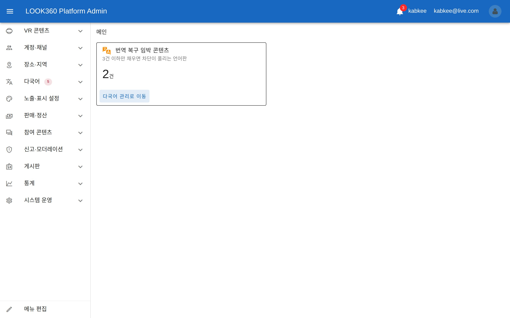
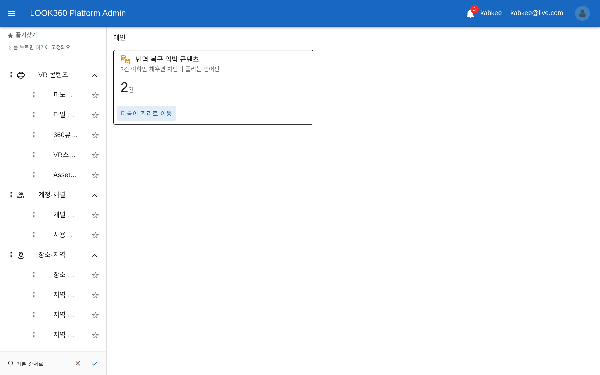
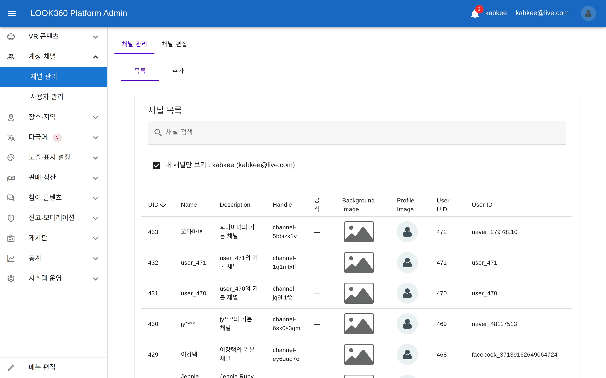
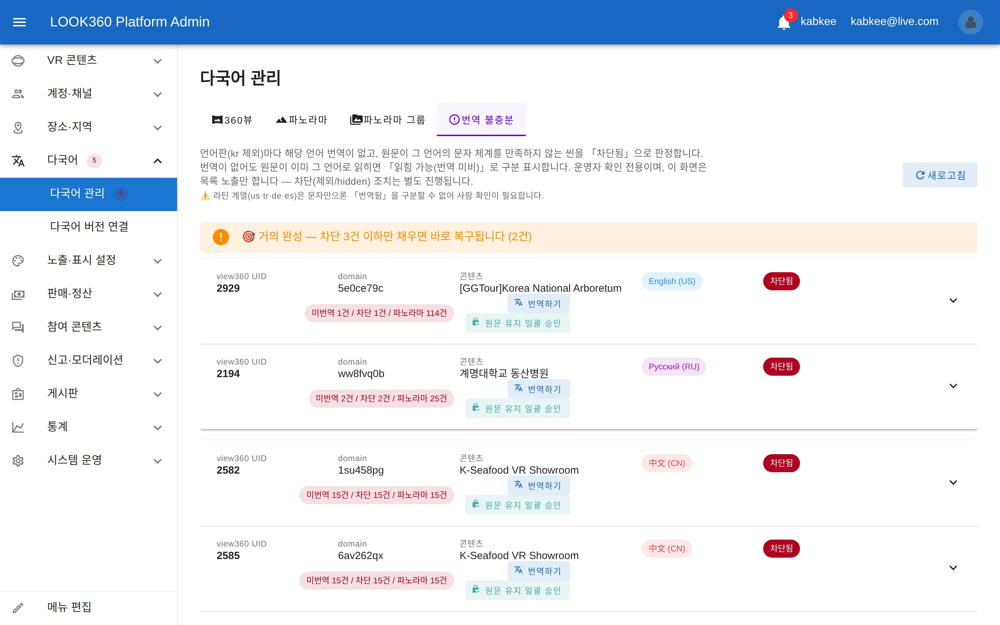
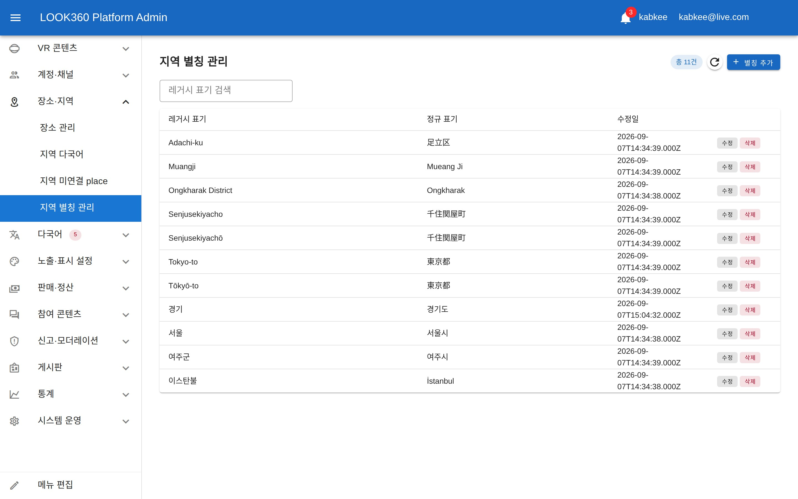
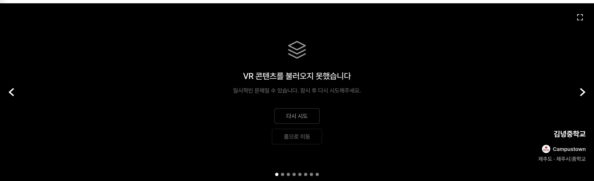
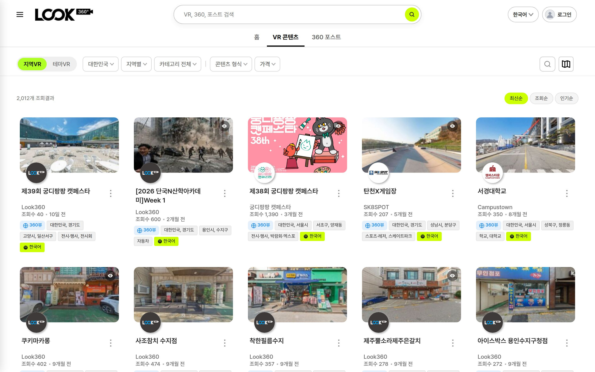
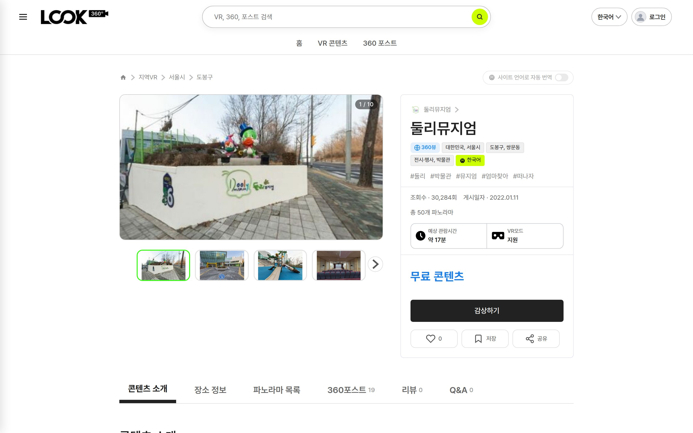

<!-- _class: cover -->
<!-- _paginate: false -->

# 주간 업무 보고

## 2026-09-09 &nbsp;~&nbsp; 2026-09-14

Indyspot AI Corp &nbsp;·&nbsp; Engineering Manager &nbsp;·&nbsp; 2026-09-16

---

<!-- _class: agenda -->

## 이번 주 주요 작업 — 「바깥으로 열려 있던 문을 닫고, 매일 쓰는 도구를 손에 맞춘」 주간

### 🔒 보안 — 운영 사이트와 권한

- 운영 사이트에 공개돼 있던 로그·업로드 파일을 차단
- 코드에 적혀 있던 비밀번호 57개 파일을 전부 회수
- 남의 이름으로 글을 쓰거나 지울 수 있던 허점 2건 봉합
- 관리자 권한을 ADMIN 하나로 통일

### 🗺️ 지역 데이터 — 5단 체계 완주

- 주소 5단 규약과 1,448건 재편을 잔여 0건으로 마무리
- 지역명 9개 언어 결측 0 달성

### 🧰 관리자 화면 — 손에 맞게

- 메뉴를 11개 그룹으로 재편하고 직접 편집할 수 있게
- 공식 채널 인증 기능 신설
- 번역을 원문 그대로 두는 승인 경로 신설

### 🖥️ 사용자 화면

- 홈 첫 화면에 핫스팟·자이로 복원
- 감상 화면 언어 전환 누락 해소
- 썸네일 깨짐 4회째 재발을 구조로 차단

### 📦 인프라 — 업로드 검증

- 파일 업로드가 기존 이미지를 덮어쓸 위험을 실제 서버에서 검증

---

<!-- _class: sec -->

Section 01

## 보안 — 바깥으로 열려 있던 문

운영 사이트에 노출돼 있던 파일과, 안에서 뚫려 있던 권한을 함께 닫았습니다.

---

## 🔴 운영 사이트의 로그 파일이 공개돼 있었습니다 9/14 NEW

업로드 기능을 점검하다 **운영 도메인(`look360.kr`)의 임시 폴더가 인터넷에 열려 있는 것**을 발견했습니다.

| 주소 | 당시 응답 | 크기 |
|---|---|---|
| `/_tmp/php_errors.log` | 200 (공개) | 약 200MB |
| `/_tmp/uploads/1669.zip` | 200 (공개) | 16.6MB |
| `/_tmp/` 디렉토리 목록 | 404 (이미 차단) | — |

> 오류 로그에는 보통 서버 경로·질의문·요청값이 섞입니다. **내용은 열람하지 않고 응답 여부만 확인**했습니다. 업로드된 파노라마 원본 압축파일도 파일명만 알면 받을 수 있는 상태로, 약 310MB가 남아 있었습니다.

---

## ✅ 차단 결과 — 노출 3건 전부 막고 정상 경로는 유지 9/14

담당자가 직접 집행하고, **집행에 관여하지 않은 별도 인원이 외부 인터넷에서 재측정**했습니다.

| 경로 | 조치 후 |
|---|---|
| `/_tmp/php_errors.log` · `/_tmp/uploads/1669.zip` · `/_tmp/krpanotools.log` | 403 (차단) |
| `/_tmp/` | 403 (차단) |
| `/sitemap.xml` (정상 동작 확인) | 200 유지 |
| `/` (정상 동작 확인) | 200 유지 |

> 2026-06-02 침입 시도 이력이 있는 서비스라, 오류 로그 공개는 다음 공격의 사전 정보가 됩니다. 발견 당일 차단까지 마쳤습니다.

---

## 🔑 비밀번호가 코드에 그대로 적혀 있었습니다 9/12~9/13 NEW

검증용 스크립트에 **개발 DB 비밀번호와 관리자 계정 비밀번호가 평문으로** 들어 있었고, 복사·붙여넣기로 번져 있었습니다.

| 저장소 | 오염 파일 수 |
|---|---|
| 모노레포 루트 | 40 |
| 서버(API) | 10 |
| 관리자 화면 | 7 |
| **합계** | **57개 파일** |

> 최초 유입은 2026-08-11이었고, 이후 검증 산출물마다 복사되며 퍼졌습니다. 저장소 3개가 모두 비공개이고 대상이 개발 환경이라 실제 사고는 아니었습니다.

---

## 🧹 두 단계로 회수 — 현재 코드와 과거 기록 모두 9/12~9/13

지금 쓰는 코드를 먼저 고치고, 과거 기록은 **오너가 직접 실행**하는 방식으로 나눴습니다.

| 단계 | 조치 | 결과 |
|---|---|---|
| 1단계 · 확산 정지 | 비밀번호를 환경변수 경유로 교체 (값 없으면 실행 실패) | 61개 파일 적용 |
| 2단계 · 과거 기록 | 저장소 3개의 커밋 기록을 재작성해 평문 제거 | 9/13 17:13 완료 |

> 관리자 계정은 2차 인증(OTP)으로 보호되고 그 비밀키는 코드에 없었기 때문에, 비밀번호만으로는 로그인이 불가능한 상태였습니다. 과거 기록 재작성으로 그 이전 커밋 번호는 모두 무효가 됩니다.

---

## 🚨 남의 이름으로 콘텐츠를 만들 수 있었습니다 9/12 NEW

로그인은 정상적으로 통과하지만, **「누구의 것인지」를 서버가 정하지 않고 요청에 적힌 값을 그대로 믿던** 결함입니다.

| 결함 | 가능했던 일 | 조치 |
|---|---|---|
| 콘텐츠 생성·수정 API | 로그인한 누구나 타인 명의로 VR 콘텐츠 생성 | 서버가 로그인 정보로 소유자 지정 |
| 시작 메시지 삭제 4개 경로 | 타인의 시작 메시지와 원본 이미지를 영구 삭제 | 소유권·관리자 검증 부착 |

> 삭제 경로는 검증 담당자가 **실제로 다른 사람의 설정을 해제하는 데 성공**하면서 드러났습니다. 처음 지목된 1건만 보지 않고 같은 파일 전체를 다시 세어 **4건**으로 확정한 뒤 일괄 처리했습니다.

---

## 🛡️ 관리자 권한을 하나로 정리했습니다 9/12

같은 `OWNER`라는 이름이 **서버에서는 「관리자보다 위」, 관리자 화면에서는 「관리자보다 아래」**로 정반대 해석되고 있었습니다.

| 항목 | 이전 | 현재 |
|---|---|---|
| 관리자 화면 접근 | OWNER도 통과 가능 | ADMIN 권한만 허용 |
| 서버 관리 API | OWNER 부여 시 193개가 콘텐츠 소유자에게 개방 | ADMIN 단일 판정 |
| 관리자 승격 | 2차 인증 검사 누락 | 승격 시 OTP 필수 + 이력 기록 |

> 오너 결정: **관리자는 승인된 소수만, 콘텐츠 소유자는 판매자 공간으로.** 자식 작업 6건 전부 완료했고, 권한별 응답을 실제 호출로 전수 확인했습니다.

---

## 🏪 판매자 공간을 판매자에게만 9/13 NEW

판매자 스튜디오를 **판매 상품이 있는 사람에게만** 열고, 권한 회수 시 즉시 차단되도록 했습니다.

| 작업 | 내용 |
|---|---|
| 권한 자동 부여 | 관리자가 판매 상품을 등록하면 채널 주인에게 판매자 권한 자동 부여 |
| 기존 판매자 이관 | 이미 판매 중이던 9명을 일괄 전환 |
| 진입 차단 | 스튜디오 링크 노출·접속·판매자 API 3중 가드 |
| 권한 회수 | 회수 즉시 기존 로그인 세션 강제 종료 (이전엔 최대 15분 통과) |

> 자식 작업 12건 전부 완료했습니다. 권한 회수가 실패해도 성공으로 응답하던 결함까지 함께 잡았습니다.

---

<!-- _class: sec -->

Section 02

## 지역 데이터 — 5단 체계 완주

여러 주에 걸친 주소 체계 정비를 이번 주에 잔여 0건으로 닫았습니다.

---

## 🗺️ 주소 5단 규약을 확정하고 닫았습니다 9/9~9/11

「시·도 → 시 → 구·군 → 읍·면 → 리·동」 **다섯 칸의 의미를 행정단위 종류로 고정**하고, 해당 없으면 비우는 규약입니다.

| 칸 | 담는 것 | 예시 |
|---|---|---|
| 1단 | 광역자치단체 | 서울특별시 · 경기도 |
| 2단 | 기초자치단체 「시」 | 성남시 · 용인시 |
| 3단 | 군 · 자치구 · 일반구 | 가평군 · 강남구 · 분당구 |
| 4단 | 읍 · 면 | 다사읍 · 백암면 |
| 5단 | 리 · 동 · 가 | 죽곡리 · 압구정동 |

> 국내 장소 1,731건을 전수 검사해 **다섯 칸으로 담기지 않는 주소는 0건**임을 확인했습니다. 자식 작업 47건 전부 완료.

---

## 📐 1,448건 재배치 — 실측 결과 잔여 0건 9/11

지난 회의에서 **착수 시점을 결정 대기**로 올렸던 계층 재배치 건입니다. 이번 주에 전량 처리를 확인했습니다.

| 재배치 대상 | 9/8 시점 | 현재 실측 |
|---|---|---|
| 군: 2단 → 3단 | 83건 | 0 |
| 읍·면: 3단 → 4단 | 73건 | 0 |
| 동·리·가: 4단 → 5단 | 1,292건 | 0 |
| (대조) 구 · 시 배치 | — | 0 |

> 보고된 수치를 인용하지 않고 **검증 규칙의 질의문을 그대로 개발 DB에 다시 실행**해 판정했습니다. 재발 방지 검사 4종도 함께 가동 중입니다.

---

## 🌐 지역명 9개 언어 — 결측 0 · 문자 혼입 0 9/11

지역 이름의 다국어 표기를 **행 수 계산이 아니라 실제 값 기준으로** 다시 셌습니다.

| 검사 축 | 결과 |
|---|---|
| 9개 언어별 이름 누락 (한·영·일·중·스·독·러·태·터) | 각 0건 |
| 전체 행 수 정합 (1,577개 지역 × 9언어) | 14,193행 일치 |
| 중국어·일본어에 한글 혼입 | 0건 |
| 러시아어에 키릴 문자가 아닌 글자 | 0건 |

> 「행이 존재하는지」만 세면 빈 값이 통과하기 때문에, **값이 비어 있지 않은지까지** 판정식에 넣었습니다. 자식 작업 17건 전부 완료.

---

## 🔌 데이터는 5단, 화면 필터는 3단까지 9/10~9/12

오너 결정에 따라 **데이터·API·관리자 입력은 5단 전부 유지하되, 사용자 목록 필터만 3단(구·군)까지** 노출합니다.

| 항목 | 방침 |
|---|---|
| 데이터·API·관리자 입력 | 5단 전부 보유 — 나중에 되돌릴 수 없으므로 유지 |
| 사용자 목록 지역 필터 | 3단까지 노출 — 읍·면까지 깔면 선택지가 수천 개로 흩어짐 |

> 점검 중 **응답에 5단 값이 빠지고 집계가 항상 0으로 나오던 경로 2곳**을 발견해 함께 고쳤습니다. 오류 없이 조용히 비어 나오던 형태라 화면만 봐서는 드러나지 않던 결함입니다.

---

<!-- _class: sec -->

Section 03

## 관리자 화면 — 매일 쓰는 도구를 손에 맞게

메뉴 구조를 다시 짜고, 쓰는 사람이 직접 배치를 바꿀 수 있게 했습니다.

---

## 🗂️ 관리자 메뉴를 11개 그룹으로 재편 9/13 NEW

메뉴를 성격별로 묶고, **주소를 직접 입력해야만 들어가지던 화면 2건**을 연결했습니다.

직접 확인
<a class="lnk admin" href="http://100.120.25.127:5277/" target="_blank">http://100.120.25.127:5277/</a>

---

## ⭐ 메뉴 순서와 즐겨찾기를 직접 편집 9/13 NEW

끌어서 순서를 바꾸고 별표로 즐겨찾기를 지정하면, **계정별로 저장돼 다음 로그인에도 유지**됩니다.

직접 확인
<a class="lnk admin" href="http://100.120.25.127:5277/" target="_blank">http://100.120.25.127:5277/</a>

---

## 🔧 편집 기능에서 잡은 결함 2건 9/13

기능을 올린 직후 검증에서 **저장이 100% 실패하는 결함**이 나와 당일 처리했습니다.

| 증상 | 원인 | 조치 |
|---|---|---|
| 순서 편집 저장이 전부 실패 | 화면 쪽 메뉴 식별자가 서버 규칙과 불일치 | 식별자 교정 + 회귀 검사 추가 |
| 즐겨찾기 16개째부터 저장 실패 | 서버 상한(15개)에 대한 화면 안내 없음 | 화면 가드·안내 추가 |
| 편집 진입 시 그룹이 펼쳐지지 않음 | 선택 동작의 부수효과가 펼침 상태를 되돌림 | 동작 순서 정정 |

> 전체 작업 트리 13건(직속 9 · 하위 4)을 완료 보고 인용이 아니라 **직접 재조회해** 확인했습니다.

---

## 🏅 공식 채널 인증 기능 신설 9/14 NEW

관리자가 채널별로 인증을 부여·회수하면, 감상 화면과 채널 페이지에 **공식 채널 표시와 안내 문구**가 나타납니다.

직접 확인
<a class="lnk admin" href="http://100.120.25.127:5277/channel" target="_blank">http://100.120.25.127:5277/channel</a>

---

## 🏅 공식 채널 — 무엇을 만들었나 9/14

DB·서버·관리자·사용자 화면 네 곳에 걸쳐 신규 구현했습니다. 기존에는 어디에도 없던 기능입니다.

| 영역 | 내용 |
|---|---|
| 데이터 | 채널 인증 컬럼 3종 (인증 여부 · 부여 시각 · 부여자) |
| 서버 | 관리자 전용 인증 부여·회수 API — 값이 실제로 바뀔 때만 이력 갱신 |
| 관리자 | 채널 목록 인증 컬럼 + 편집 화면 토글 · 부여 이력 |
| 사용자 | 감상 화면·채널 헤더·VR 상세 3개 지면 표시 + 툴팁 7개 언어 |

> 문구는 오너 확인을 거쳐 「인증 채널」에서 「공식 채널」로 확정했습니다.

---

## 📝 번역을 원문 그대로 둘 수 있는 승인 경로 9/12 NEW

브랜드명·고유명사처럼 **번역하지 않는 것이 옳은 항목**이 「번역 불충분」으로 영구히 차단되던 문제를 풀었습니다.

직접 확인
<a class="lnk admin" href="http://100.120.25.127:5277/i18n-management" target="_blank">http://100.120.25.127:5277/i18n-management</a>

---

## 🧭 지역 관리 메뉴 신설 + 배지 표시 복구 9/11~9/12

지역 화면 3개가 **메뉴에 없어 주소를 직접 입력해야만** 들어갈 수 있던 상태를 해소했습니다.

직접 확인
<a class="lnk admin" href="http://100.120.25.127:5277/admin/regions/aliases" target="_blank">http://100.120.25.127:5277/admin/regions/aliases</a>

---

## 🔢 「번역 불충분」 배지가 항상 보이지 않던 이유 9/12

메뉴 옆 건수 배지가 **로그인 확인이 끝나기 전에 조회를 시도하고 그대로 종료**되어, 항상 빈 상태로 남아 있었습니다.

| 항목 | 내용 |
|---|---|
| 증상 | 「다국어 관리」 옆 건수 배지가 항상 미표시 |
| 원인 | 인증 복원 이전에 조회 → 조기 반환 (이전 수정분의 재발) |
| 조치 | 인증 확정 시점에 조회하도록 순서 교정 |

> 같은 형태의 재발이라 **회귀임을 기록**해 두고 고쳤습니다. 관리자 메뉴 쪽에서는 이번 주에 주소 슬롯 라벨 불일치, 레벨 선택 표기 등 표시 오류도 함께 정리했습니다.

---

<!-- _class: sec -->

Section 04

## 사용자 화면 — 보이는 것을 고치다

첫 화면부터 감상 화면까지, 눈에 띄는 결함을 묶어 처리했습니다.

---

## 🖼️ 홈 첫 화면 — 핫스팟과 자이로 복원 9/14 NEW

첫 화면 VR에 **핫스팟과 건물 툴팁을 다시 표시**하고, 모바일에서는 기기를 기울이면 화면이 따라 움직입니다.

직접 확인
<a class="lnk" href="http://100.120.25.127:5174/" target="_blank">http://100.120.25.127:5174/</a>

---

## 🖼️ 첫 화면 — 무엇이 달라졌나 9/14

세 가지를 함께 손봤습니다. 이 중 자이로는 **플러그인 이름이 어긋나 애초에 동작하지 않던** 선행 결함이었습니다.

| 항목 | 이전 | 현재 |
|---|---|---|
| 핫스팟·건물 툴팁 | 의도적으로 0개로 렌더 | 표시 (씬 이동은 계속 차단) |
| 모바일 자이로 | 이름 불일치로 미동작 | 권한 불필요 기기는 자동 ON |
| 지역 표기 | 전체 단계 나열 | 중복 제거 후 상위 2단계 |

> 핫스팟 표시는 9/3에 「히어로에서 씬 이동 차단」으로 정했던 결정을 **오너가 이번에 일부 번복**한 것입니다. 이동 차단이라는 취지는 그대로 유지합니다.

---

## 🔍 VR 목록 — 국가 선택을 따로 뺐습니다 9/14 NEW

국가를 지역 필터에서 분리해, **기본값 대한민국으로 두고 먼저 고르는** 흐름으로 바꿨습니다.

직접 확인
<a class="lnk" href="http://100.120.25.127:5174/vr-list" target="_blank">http://100.120.25.127:5174/vr-list</a>

---

## 🏷️ VR 상세 — 장소 정보를 아이콘으로 9/12

항목마다 글자 제목이 붙어 있던 장소 정보를 **아이콘으로 바꾸고 디자인 시안 순서에 맞췄습니다.**

직접 확인
<a class="lnk" href="http://100.120.25.127:5174/vr-info/v47cpxre" target="_blank">http://100.120.25.127:5174/vr-info/v47cpxre</a>

---

## 🌏 감상 화면 — 언어를 바꿔도 따라오지 않던 곳 9/14 NEW

콘텐츠 언어를 바꿔도 **목록과 이동 버튼의 이름만 한국어로 남던** 결함 2건을 처리했습니다.

| 대상 | 이전 | 현재 |
|---|---|---|
| 그룹 안 파노라마 목록·경로명 | 언어 전환에 미반응 | 실시간 반영 + 연속 전환 역전 방지 |
| 이동 버튼 라벨 | 한국어 잔존 | 98.8% 즉시 치환 |
| 이동 버튼 툴팁 | 번역 없음 | 822건 자동 번역 적용 |

> 자식 작업 17건 전부 완료했습니다. 저장돼 있던 언어별 파일 130건도 함께 다시 생성했습니다.

---

## 🖼️ 썸네일 깨짐 — 4번째 재발을 구조로 막았습니다 9/12~9/13

같은 증상이 **네 번 반복**됐습니다. 매번 「그 화면 한 군데」만 고쳤기 때문입니다. 이번엔 전수 정리와 재발 차단을 함께 했습니다.

| 항목 | 실측 |
|---|---|
| 콘텐츠 목록 미리보기 이미지 | 29건 전부 깨짐 (200 응답 0건) |
| 그중 주소에 빈 값이 박힌 것 | 26건 |
| 이전 수정이 다룬 범위 | 3건뿐 |
| 경로 계산을 제각각 하던 지점 | 13곳 → 공용 규칙으로 통일 |

> 오너 지시: **「벌써 여러 번 반복이니 코드로 단단히 규정하고 재발 방지를 확실히 할 것」.** 재발 감시 검사 5종을 신설했습니다.

---

## 📱 모바일 화면 정리 — 마이페이지·지도·작성 흐름 9/12~9/14

8/19 회의에서 받은 체크리스트를 영역별로 묶어 처리했습니다.

| 영역 | 처리 내용 |
|---|---|
| 마이페이지 5건 | 탭 메뉴가 카드에 가리던 문제 · 좌우 화살표 · 필터 표시 · 영수증 헤더 고정 · 비밀번호 안내 |
| VR 목록 지도 3건 | 지도 전체화면에서 카드가 떠 보이던 문제 · 마커 정보창 · 필터 시트 |
| 360포스트 작성 | 위치 선정을 먼저 한 뒤 작성 폼으로 (오너 요청으로 흐름 변경) |
| 게시판 카테고리 | 글자가 잘리던 칩을 공통 디자인으로 통일 (4개 지면) |

> 작성 흐름 변경은 9/7에 정했던 「폼 먼저」 방식을 **오너가 이번에 뒤집은** 것으로, 이전 금지 조항을 해제하고 진행했습니다.

---

<!-- _class: sec -->

Section 05

## 인프라 — 업로드와 반영

파일이 엉뚱한 곳에 풀리지 않는지 실제 운영 서버에서 확인했습니다.

---

## 📦 압축 파일 업로드 — 실제 서버에서 검증 9/14 NEW

오너 우려: **압축이 잘못된 위치에 풀리면 기존 이미지를 덮어써 서비스가 망가진다.** 그 경로를 실제로 확인했습니다.

| 확인 항목 | 결과 |
|---|---|
| 운영 서버 카나리 테스트 | 실제 장소 1건으로 1·2단계 완주 |
| 이미 복사 중인 위치에 새 압축 투입 | 거부됨 (섞이는 경로 없음) |
| 배포 상태 (로컬 · 원격 · 운영 서버) | 3곳 동일 · 미반영 0건 |

> 점검 도중 **기존 파일 덮어쓰기 정책**은 오너 확인을 거쳐 「병합 유지」로 확정했습니다. 자식 작업 4건 전부 완료.

---

## 🔧 고쳤는데 반영되지 않던 문제 9/13

코드를 고치고 빌드까지 했는데 **실행 중인 서버 프로세스가 옛 코드를 그대로 돌리고 있던** 사례가 이번 주에 2번 나왔습니다.

| 사례 | 상황 | 조치 |
|---|---|---|
| 권한 결함 수정 | 수정본이 서비스 중인 프로세스에 미도달 | 재기동 후 실제 응답으로 확인 |
| 업로드 용량 초과 응답 | 빌드는 10:30, 프로세스는 10:04 기동 | 재기동 + 시각·응답 실측 기록 |

> 이후로는 **「반영됐는지」를 코드가 아니라 실행 중인 서버의 응답으로 판정**하도록 절차에 넣었습니다. 용량 초과 시 오류 응답이 500으로 새던 것도 413으로 바로잡았습니다.

---

## 🎯 이번 주 안건 — 오너 결정 대기

현재 응답 대기 중인 승인 카드가 3건 있습니다.

| 항목 | 필요한 판단 |
|---|---|
| 🔴 **테스트 계정·개인정보 처리** | 금지 결정 직후 새 테스트 계정이 생성된 건의 사후 처리 + 과거 기록의 실사용자 정보 제거 범위 |
| 🟡 **설정 탭 언어 메뉴 구성** | 목업 기준 6개 항목의 동작 방식 선택 (네비 형태·언어 선택 UI·안내 문구 등) |
| 🟡 **대기 중인 작업 착수 여부** | QC 샘플 데이터 정리 · 구독 알림 9종 · 보드 회신 대기 3건 중 착수할 건 선택 |
| 🟡 **이월 3건** | 사진 촬영일자 정정 범위 · 실 카드 결제 오픈 · 미관람 30일 소멸(법적 검토) |

> 지난주 안건이던 지역 데이터 재편 1,448건은 이번 주에 잔여 0건으로 완료됐습니다.

---

## 📊 주간 처리량

256

완료 작업

65

작업 단위(EPIC)

253

코드 반영

2,076

주간 방문자

| 저장소 | 코드 반영 | 변경 파일 | 내용 |
|---|---|---|---|
| 서버(API) | 186건 | 596개 | 보안 봉합 · 공식 채널 · 언어 전환 · 썸네일 경로 |
| 사용자 화면 | 42건 | 195개 | 홈 히어로 · VR 목록 · 마이페이지 · 360포스트 |
| 관리자 화면 | 25건 | 79개 | 사이드바 재편·편집 · 채널 인증 · 번역 승인 |
| 검증 증빙 | 196건 | — | 실측 스크립트 · 검증 기록 |

> 서비스 지표(9/9~9/14, 6일): 주간 방문자 2,076명(-5.1%) · 세션 2,327건(-7.2%) · 페이지뷰 10,607회(-14.0%) — 직전 동일 길이(9/3~9/8) 대비이며, 전 항목이 소폭 하락했습니다.

---

## 🔗 라이브 엔드포인트

사용자
<a class="lnk" href="http://100.120.25.127:5174" target="_blank">Look360 (개발) — 핫스팟 복원된 첫 화면</a>
<a class="lnk" href="http://100.120.25.127:5174/vr-list" target="_blank">VR 목록 — 국가 선택 분리</a>

이번 주 신설
<a class="lnk admin" href="http://100.120.25.127:5277/channel" target="_blank">관리자 — 공식 채널 인증</a>
<a class="lnk admin" href="http://100.120.25.127:5277/i18n-management" target="_blank">관리자 — 번역 원문 유지 승인</a>

재편된 화면
<a class="lnk admin" href="http://100.120.25.127:5277/" target="_blank">관리자 — 사이드바 11그룹 · 메뉴 편집</a>

외부
<a class="lnk legacy" href="https://look360.co.kr" target="_blank">look360.co.kr (운영)</a>

---

<!-- _class: closing -->
<!-- _paginate: false -->

## 감사합니다

운영 사이트에 열려 있던 파일을 닫고, 매일 쓰는 관리자 메뉴를 직접 편집할 수 있게 하고, 여러 주에 걸친 지역 5단 정비를 잔여 0건으로 마무리한 주간이었습니다.

Indyspot AI Corp &nbsp;·&nbsp; Engineering Manager &nbsp;·&nbsp; 2026-09-16
